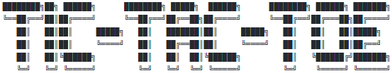
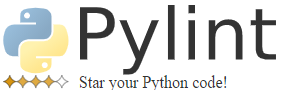
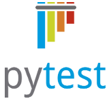
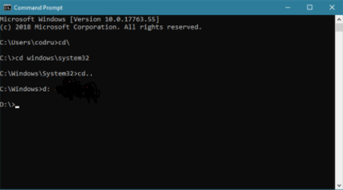

## Fall 2020 -- //TODO: Team Name



# HOW TO PLAY

_Once you've checked out everything here_, please visit our Wiki and read our User Documentation page -- just click the link below!

https://github.com/swozzy/tic-tac-toe/wiki/User-Documentation

# SETTING IT ALL UP

### Prerequesites
* #### Checking Python version
In order to ensure proper gameplay, we suggest having the most up-to-date version (3.9.0+) of Python installed. Please see the steps below for making sure that this version is installed. 

1. Open a terminal
2. Type ```python --version```
3. Press Enter. The terminal should print which version of Python you have installed. Please make sure that the version number is 3.9.0 or higher. If you have an older version of Python installed, please see the "Installing Python" subsection underneath "Setting Up."

__WARNING__: Not having the most recent version installed may cause bugs, errors, and failure in starting the application.

* #### Libraries Used



  [Pylint](https://www.pylint.org/) is a "Python static code analysis tool which looks for programming errors, helps enforcing a coding standard, sniffs for code smells and offers simple refactoring suggestions." This library helped us to build you this wonderful game and, if you decide to branch it for yourself, we suggest you use it aswell!
  


  [Pytest](https://docs.pytest.org/en/stable/) is "a framework that makes building simple and scalable tests easy." Please make sure this library is installed if you would like to perform tests on our code.

### Setting up

* #### Installing Python

If you don't have Python installed, or you have a version of Python that is older than 3.9.0, please reference the instructions below on how to install its latest version. Alternatively, watch the video below.

https://www.youtube.com/watch?v=03PkciQUujk

1. Go to https://www.python.org/downloads/
2. Click the "Download Python 3.9.X" button
3. Open the downloaded file
4. Proceed through the installation. Make sure you install a 64-bit (x86-64) version of Python
5. Open a terminal and execute the ```python --version``` command to ensure that you installed the latest version

* #### Installing Necessary Libraries
   * Pylint
    1. Open a terminal
    2. Type in ```python -m pip install pylint``` and press Enter
    3. The download should complete automatically.
    
    For additional help, please see Pylint's website's instructions: https://www.pylint.org/#install
   
   * Pytest
    1. Open a terminal
    2. Type in ```pip install -U pytest``` and press Enter
    3. The download should complete automatically.
    
    For further help, please see Pytest's website's instructions: https://docs.pytest.org/en/3.0.1/getting-started.html


* #### Downloading Github Code
  1. You're probably in this repository already, but if not, please follow this link: https://github.com/swozzy/tic-tac-toe/tree/main
  2. Click the green " ⬇ Code" button
  3. Download the repository as a ZIP file. It should be called "tic-tac-toe-main"
  4. Open the folder that contains the ZIP file. Extract the ZIP files to that folder
  5. You should see a folder called "tic-tac-toe-main". We will use the terminal to get to the main.py function and execute it in the section below called "Running the Game."
  
  
  __NOTE (1)__: Location of main function (after downloading and extracting): C:\...\FOLDER_EXTRACTED_TO\tic-tac-toe-main\methods_and_classes\**main.py**
  
  __NOTE (2)__: There are no branches besides the ```main``` branch, so please use that one.
  
  
  
* #### Running the Game
  1. Open up the terminal and ```cd``` your way to "tic-tac-toe-main."
  2. Once you are in the folder, type ```cd methods_and_classes``` and press Enter.
  3. Now you can run main.py by entering ```python main.py```.
  4. Have fun!
 
### Running tests
  1. <Insert information on how to run tests here>


Welcome to User Documentation!
This wiki contains information on how to play the game.
Before we start, make sure you have read the readme file and have all prerequisites ready.
- First, you should run the main.py file in the tic-tac-toe folder to start game.
- It will ask you whether you want to hear the rules of the game or not. Input should be one of the followings:"yes", "ye", "y", "ya", "yea", "yeah", "yup";"no", "n", "nah", "na" in either letter case. Space is not expected in the input. There will be an error message if the input is not recognized.
- After reading/skipping the rules, the game will then ask you about player names. Player name can be any string (space letters is fine)
- The program will randomly decide the order of the player i.e. who goes first. And it will prompt a message to let you know.
- The player who goes first (say player 1) can choose which symbol she/he wants. Either X or O. Input should be X or O in either case. Space is not expected.
- Player 1 can choose the first spot now. The board is assigned with indexes 1-9. Each number corresponds to a spot. Read from left to right and top to bottom.
- Once a player has chosen a spot, the board will be refreshed and the chosen spot will be occupied by the player's symbol. The user is expected to input numbers ONLY, and cannot reoccupy a spot. The program will also prompt error messages if any of these happens.
- The game will end if any one of the players wins, or if there is a tie. User is not expected to quit in the middle of the game.

- After a game has ended, the program will ask if you want to play again. Input should be one of the followings:"yes", "ye", "y", "ya", "yea", "yeah", "yup";"no", "n", "nah", "na" in either letter case. Space is not expected in the input. There will be an error message if the input is not recognized.

If you choose to play again, the game will start with prompting if you want to hear rules of the game, if you choose not to start a new game, the program will end.
If you choose to play again, the game will start with prompting if you want to hear rules of the game, if you choose not to start a new game, the program will end.

All information on what happened during a game is logged in the game_log.log file in the folder.
